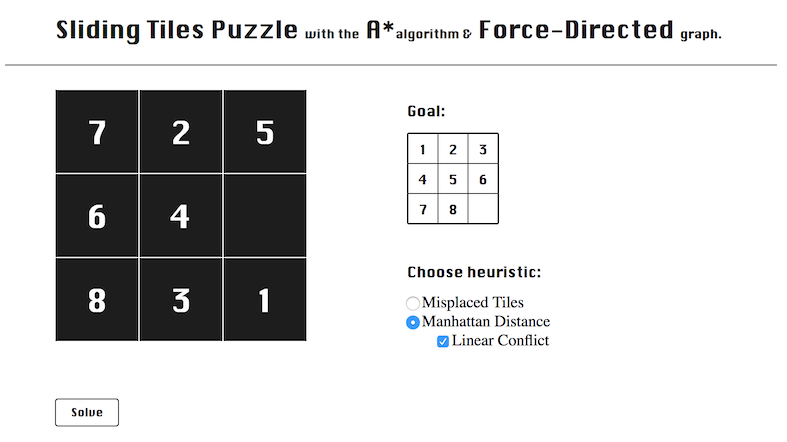

#### Problem
The purpose of this puzzle is to arrange tiles so that all of them are in the correct positions. The rearrangement task is achieved by swapping an empty tile with some other tile in all possible directions (up, down, left, and right).

#### Solution
The problem is solved by implementing A-star search algorithm that finds a solution with the minimum number of moves to the goal configuration. The search is guided by three different heuristics, and the more clever heuristic, the sooner the optimal solution will be found.

The intelligence of the search is determined by a number of states it visits - the smaller the number of states, the more intelligent it is and the sooner it will provide a solution.
My Manhattan Distance heuristic calculates solution in 0.26s.

##### Motivation
Study for fun.

#### Setup
After cloning the project, enter the following lines on the command-line:

```
$ bundle install
$ ruby app.rb
```
#### Test
```
$ rspec
```
#### Heroku
[Tiles Game](https://tiles-game.herokuapp.com/)

#### References

[Arnaldo Perez Castano](https://www.smashingmagazine.com/2016/02/javascript-ai-html-sliding-tiles-puzzle/)

----

#### Notes
##### MVP
```
Ruby implemented A* search algorithm with Manthatan Distance and Misplaced Tiles heuristics.
```
##### V2
```
Interactive interface
- JavaScript
- p5.js
- ajax, jQuery
```
```
Player is able to generate graph made of open list nodes sorted according to depth
```

##### To be implemented
```
Force directed (spring systems) graph tree representing all nodes in order.
```
```
Linear Conflict heuristic that will improve the timing.
```

----

##### Things I have learnt from this project:
- Breadth-first search algorithm
- A-star algorithm
- Priority Queues
- Admissible Heuristics (Misplaced Tiles, Manhattan Distance and Linear Conflict)
