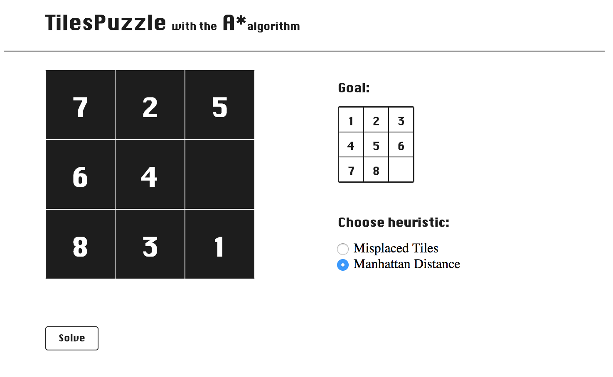

The purpose of the puzzle is to rearrange the initial configuration of the tiles to match another configuration known as the goal configuration. The rearrangement task is achieved by swapping the empty tile with some other tile in all possible directions (up, down, left, and right).

## Pseudo-Code

A* algorithm

initialize the open list
initialize the closed list
put the starting node on the open list (you can leave its f at zero)

while the open list is not empty
   find the node with the least f on the open list, call it "q"
   pop q off the open list
   generate q's 8 successors and set their parents to q
   for each successor
     if successor is the goal, stop the search
       successor.g = q.g + distance between successor and q
       successor.h = distance from goal to successor
       successor.f = successor.g + successor.h

       if a node with the same position as successor is in the OPEN list \
           which has a lower f than successor, skip this successor
       if a node with the same position as successor is in the CLOSED list \
           which has a lower f than successor, skip this successor
       otherwise, add the node to the open list
   end
   push q on the closed list
end

## Motivation

Search algorithms study for fun.

## Installation

## API Reference

Depending on the size of the project, if it is small and simple enough the reference docs can be added to the README. For medium size to larger projects it is important to at least provide a link to where the API reference docs live.

## Tests

Describe and show how to run the tests with code examples.

## Contributors

REFERENCES: [Arnaldo Perez Castano] (https://www.smashingmagazine.com/2016/02/javascript-ai-html-sliding-tiles-puzzle/)

## License

A short snippet describing the license (MIT, Apache, etc.)
